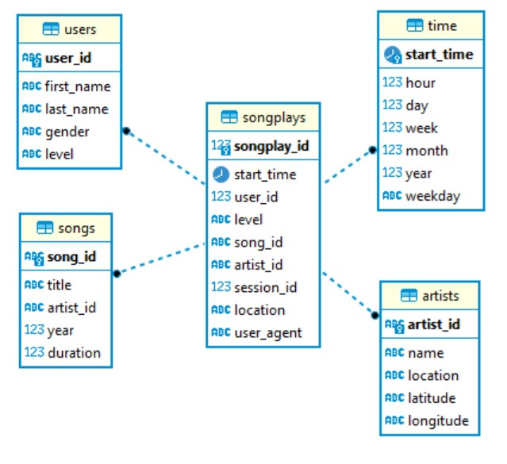

# Project: Data Lake
-------------------------

### Introduction

In this project, we will help Sparkifly music streaming startup to move their data warehouse to a data lake. Their data resides in S3, then we will provide an ETL pipeline that extracts their data from S3, processes them using Spark, and loads the data back into S3 as a set of dimensional tables.

### Project Datasets

We'll be working with two datasets that resides in S3. Here are the S3 links for each:

+ **Song Dataset** - The first dataset is a subset of real data from the Million Song Dataset. Each file is in JSON format and contains metadata about a song and the artist of that song. The files are partitioned by the first three letters of each song's track ID. For example, here are file paths to two files in this dataset.

```
song_data/A/B/C/TRABCEI128F424C983.json
song_data/A/A/B/TRAABJL12903CDCF1A.json
```

And below is an example of what a single song file, TRAABJL12903CDCF1A.json, looks like.

```
{"num_songs": 1, "artist_id": "ARJIE2Y1187B994AB7", "artist_latitude": null, "artist_longitude": null, "artist_location": "", "artist_name": "Line Renaud", "song_id": "SOUPIRU12A6D4FA1E1", "title": "Der Kleine Dompfaff", "duration": 152.92036, "year": 0}

```

+ **Log Dataset** - The second dataset consists of log files in JSON format generated by this event simulator based on the songs in the dataset above. These simulate app activity logs from an imaginary music streaming app based on configuration settings.

The log files in the dataset you'll be working with are partitioned by year and month. For example, here are file paths to two files in this dataset.

```
log_data/2018/11/2018-11-12-events.json
log_data/2018/11/2018-11-13-events.json
```

And below is an example of what the data in a log file, 2018-11-12-events.json, looks like.


### Schema for Song Play Analysis

The database schema is shown as follows




### Data processing

You will find out all processing steps into `etl.py` file.

To create `songs_table` we used the command **select()** in order to get only the columns required: 'song_id', 'title', 'artist_id', 'year', 'duration'.
Also removed eventually duplicated values, with the command **dropDuplicates()**. The sames procedure was used to create other tables.

As Sparkify mentioned that their user base and song database is growing, make sense we use **PySpark partitions**. This way we will access the data faster and provides the ability to perform an operation on a smaller dataset. To do so, we partioned the songs_table by 'year', 'artist_id'.
The same happens with the table `time_table` and `songplays_table` partioned by 'year', 'month'.


